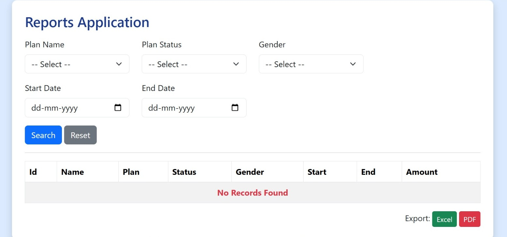
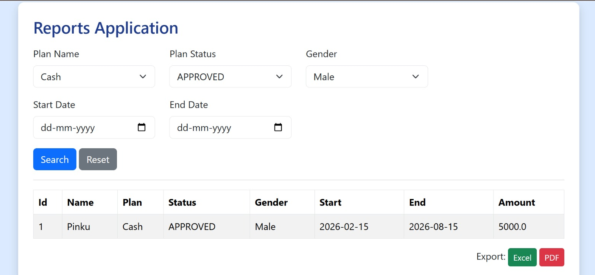
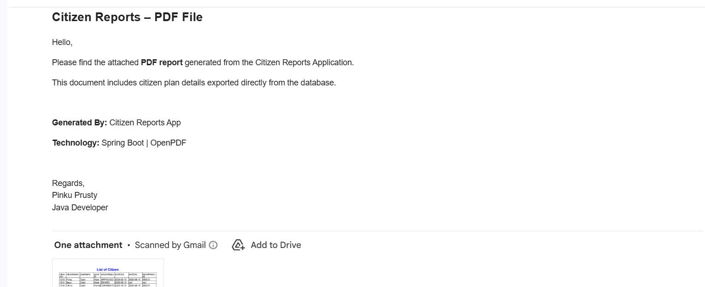

# 🚀 Citizen Reports App – Spring Boot Project ✨

Citizen Reports App is a Spring Boot MVC web application that provides dynamic search and reporting capabilities for citizen plan data.  
This project is strongly focused on backend development and demonstrates real-world enterprise concepts such as database-driven UI components, dynamic search, report generation, export to Excel and PDF, and email integration.

------------------------------------------------------------

🚀 Features

🔹 Database-driven dropdown filters (no hardcoded values)  
🔹 Multi-criteria dynamic search using Spring Data JPA  
🔹 Instant result rendering  
🔹 Excel Export 📊 (Apache POI)  
🔹 PDF Export 📄 (OpenPDF)  
🔹 Email Reports 📧 (Spring Boot Mail)  
🔹 Clean Layered MVC Architecture  

------------------------------------------------------------

🖥️ Tech Stack

Backend  
🔹 Java  
🔹 Spring Boot  
🔹 Spring MVC  
🔹 Spring Data JPA  

Database  
🔹 MySQL  

Reporting & Utilities  
🔹 Apache POI (Excel Generation)  
🔹 OpenPDF (PDF Generation)  
🔹 Spring Boot Mail (Email Integration)

View Layer  
🔹 JSP  
🔹 JSTL  
🔹 Bootstrap  

------------------------------------------------------------

📂 Project Structure

Problems are organized by layer:

```
Reports_App/
│
├── controller/
├── service/
├── repository/
├── entity/
├── search/
├── util/
└── runner/
```
------------------------------------------------------------

⚙️ Application Workflow

Runner Class → Database Initialization → Dropdown Values from DB → User Search Filters → Dynamic Results → Excel / PDF Export → Email Delivery

------------------------------------------------------------

📸 Application Preview

🖥 Front Page  


🔎 Dynamic Search Result  


📧 Email Report Preview  


------------------------------------------------------------

⚙️ Setup Instructions

1️⃣ Clone Repository  

git clone <your_repo_url>

2️⃣ Open Project  

Import into IntelliJ IDEA / Eclipse / Spring Tool Suite

3️⃣ Configure Database (application.properties)

spring.datasource.url=jdbc:mysql://localhost:3306/your_database  
spring.datasource.username=your_username  
spring.datasource.password=your_password  

4️⃣ Configure Mail (Required for Email Feature)

spring.mail.host=smtp.gmail.com  
spring.mail.port=587  
spring.mail.username=your_email@gmail.com  
spring.mail.password=your_app_password  

⚠ Use Gmail App Password (NOT normal password)

5️⃣ Run Application  

Run Spring Boot main class

6️⃣ Access Application  

http://localhost:8080/

------------------------------------------------------------

🎯 Key Learning Highlights

🔹 Database-driven UI design  
🔹 Dynamic search with Spring Data JPA  
🔹 Excel & PDF report generation  
🔹 Email integration with attachments  
🔹 Clean enterprise project structure  

------------------------------------------------------------

👨‍💻 Author

Pinku Prusty ✨  
☕ Java Developer  

🔗 LinkedIn: https://www.linkedin.com/in/pinkuna-prusty-55b487273/  
📧 Email: pinkunaprusty108@gmail.com
